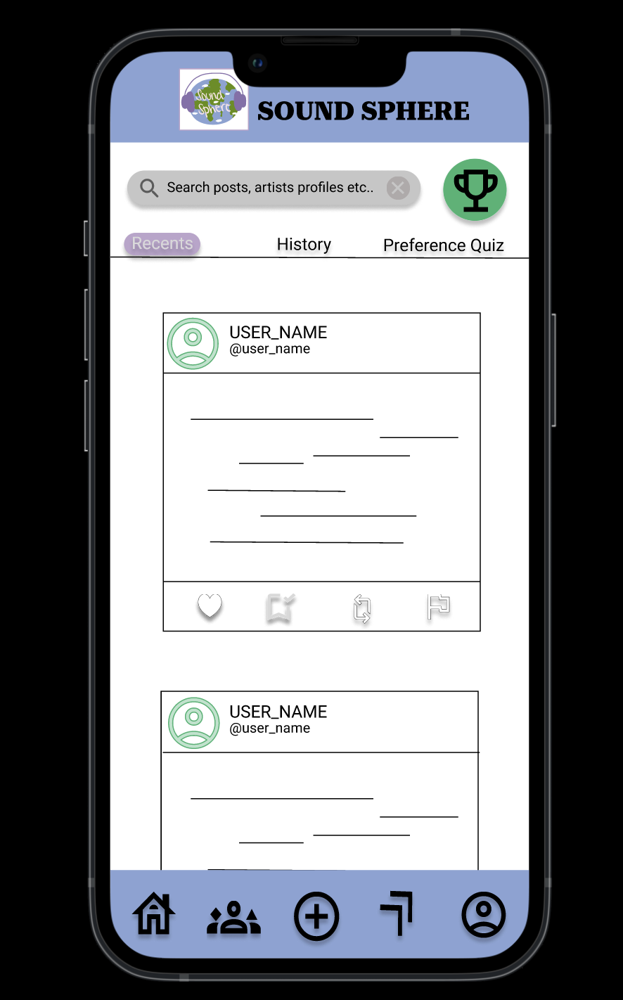
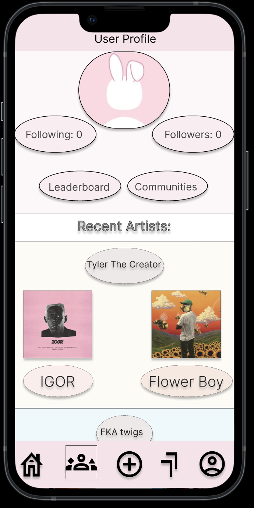
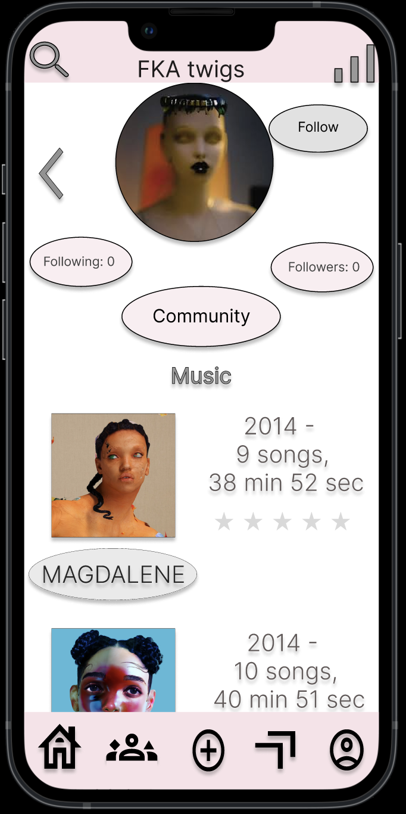

# Interactive Mockup Music Reviewing Application


This repository contains an embedded collaborative Figma interactive prototype for a music reviewing application.  
This was a **group project**, and my contributions included creating the **Home Page**, **Profile Page**, **Artist Pages**, and **Artist Album Pages**, as well as establishing the **interactive links** between each of these pages.

🔗 **Live Demo:** [View on GitHub Pages](https://msaintjean27.github.io/InteractiveMockupMusicReviewingApplication/)

---

## About the Project
This interactive prototype demonstrates:
- A user-friendly interface for browsing and reviewing music
- Interactive navigation between pages
- Smooth transitions and responsive design
- A consistent, modern visual style suitable for music enthusiasts

## Tools Used
- **Figma** – UI/UX design
- **HTML** – Embedding the Figma prototype
- **GitHub Pages** – Hosting the live demo

## Screenshots

| Home Page | Profile Page | Artist Page |
|-----------|--------------|-------------|
|  |  |  |

## How to View Locally
1. Clone this repository:
   ```bash
   git clone https://github.com/msaintjean27/Interactive-Mockup-Music-Reviewing-Application.git
